# Suite Mobile — Open Source Flutter Monorepo

A Flutter monorepo containing three white-label app templates and a set of shared infrastructure packages. Each template is a fully functional, offline-capable app that can be configured and connected to a live backend by filling in the `.env` file.

---

## Table of Contents

1. [Repository Structure](#repository-structure)
2. [Templates Overview](#templates-overview)
3. [Screenshots](#screenshots)
4. [Shared Packages](#shared-packages)
5. [Prerequisites](#prerequisites)
6. [Getting Started](#getting-started)
7. [Environment Configuration](#environment-configuration)
8. [Running a Template](#running-a-template)
9. [Offline / Demo Mode](#offline--demo-mode)
10. [Adding a New Template](#adding-a-new-template)
11. [Architecture Overview](#architecture-overview)
12. [Key Dependencies](#key-dependencies)

---

## Repository Structure

```
suite_mobile/
├── apps/
│   ├── template_a/          # Template A — City Experience app (home feed, events, categories, services)
│   ├── template_b/          # Template B — Civic / Dashboard app (news, FAQ, services, companies)
│   └── template_c/          # Template C — Listings & Discovery app (events, listings, map, interests)
│
├── packages/
│   ├── network/             # HTTP client, interceptors, base API helper
│   ├── routing/             # GoRouter utilities, route observer, refresh stream
│   ├── theme/               # App theme, color tokens, dark/light mode
│   ├── locale/              # Localization initializer, translation utilities
│   ├── preference_manager/  # Hive + SharedPreferences wrapper
│   └── common_components/   # Reusable widgets (AppBar, WebView, BottomSheet, etc.)
│
└── pubspec.yaml             # Root — Melos workspace config + shared dependency versions
```

---

## Templates Overview

### Template A — `apps/template_a`

A city-experience / event-discovery app with a rich home feed, category browsing, and a services hub.

| Property | Value |
|---|---|
| Package name | `template_a` |
| Version | `1.0.0+1` |

**Home screen components (driven by `assets/config/homepage.json`)**

| Slug | Description |
|---|---|
| `header_image` | Full-width hero banner |
| `search_bar` | Keyword search entry point |
| `content_slider_v4` | 4-item horizontal card carousel |
| `content_slider_v5` | Events category feed slider |
| `sub_category_slider` | Sub-category chip row |
| `content_slider_v6` | Generic content slider |
| `tile_slider` | Tile-style horizontal scroller |
| `service_hub_card` | Services hub entry card |

**Config files in `assets/config/`**

| File | Purpose |
|---|---|
| `homepage.json` | Home screen component layout and data |
| `categories.json` | Category tree (events, shopping, culture, etc.) |
| `listings.json` | Sample event/listing items |
| `services.json` | Service cards shown in the hub |
| `bottom_config.json` | Bottom navigation tabs config |
| `legal.json` | Privacy, imprint, terms URLs |
| `theme_config.json` | App colors and typography overrides |
| `fav_categories.json` | Favourite categories seed data |
| `favourites.json` | Favourites seed data |

**Bottom navigation tabs**

| Tab | Action |
|---|---|
| Home | `experience` feature screen |
| Discover | `discover` feature screen |
| Events | `category` → `events` screen |
| Profile | `profile` feature screen |

---

### Template B — `apps/template_b`

A civic information app focused on news, FAQs, a company/business directory, and a services dashboard.

| Property | Value |
|---|---|
| Package name | `template_b` |
| Version | `1.0.0+1` |

**Config files in `assets/config/`**

| File | Purpose |
|---|---|
| `homepage.json` | Dashboard component layout |
| `services.json` | Service list items |
| `news.json` | News/article feed |
| `news_detail.json` | Single news article detail |
| `companies.json` | Business/company directory entries |
| `dashboard.json` | Dashboard widget config |
| `faq.json` | Frequently asked questions |
| `legal.json` | Privacy, imprint, terms URLs |
| `theme.json` | App theme overrides |
| `bottom_nav.json` | Bottom navigation config |

---

### Template C — `apps/template_c`

A full listings and discovery app with event listings, map view, interest-based filtering, favourites, and an offline listing cache.

| Property | Value |
|---|---|
| Package name | `template_c` |
| Version | `1.0.0+1` |

**Config files in `assets/config/`**

| File | Purpose |
|---|---|
| `homepage.json` | Home screen component layout |
| `listings.json` | General listings feed |
| `listings_kultur.json` | Culture category listings |
| `listings_musik.json` | Music category listings |
| `listings_kultur_created.json` | User-created culture listings |
| `listings_search.json` | Search results seed data |
| `interests.json` | Interest/tag options for filtering |
| `services.json` | Services list |
| `faq.json` | FAQ entries |
| `legal.json` | Privacy, imprint, terms URLs |
| `profile.json` | User profile seed data |
| `theme.json` | App theme overrides |
| `bottom_nav.json` | Bottom navigation config |

---

## Screenshots

All screenshots show the templates running with the bundled demo configuration (placeholder content and images) — every label, color and image is white-label configurable per municipality.

### Template A — City Experience

| Home feed | Discover | Events | Event detail |
|---|---|---|---|
| 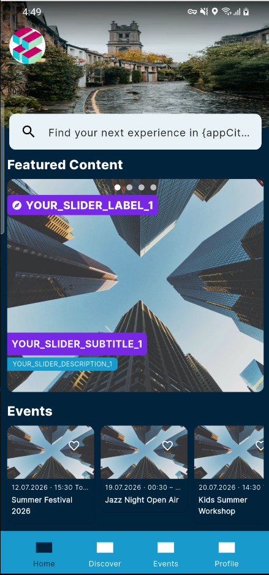 | 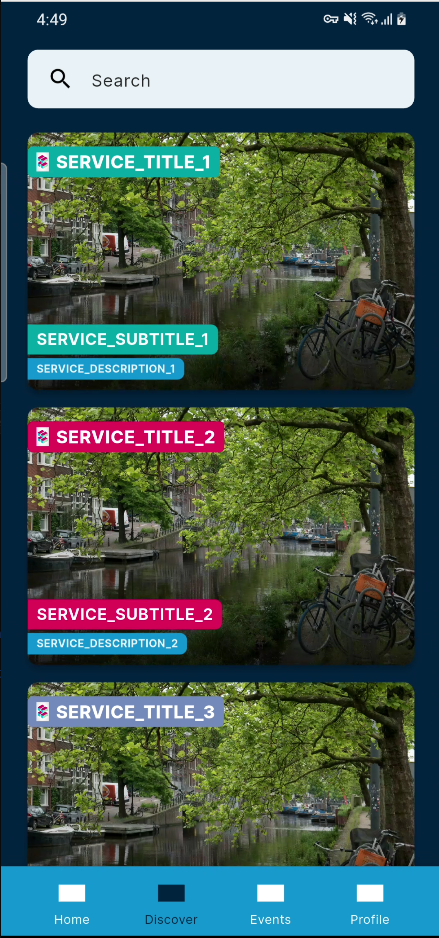 | 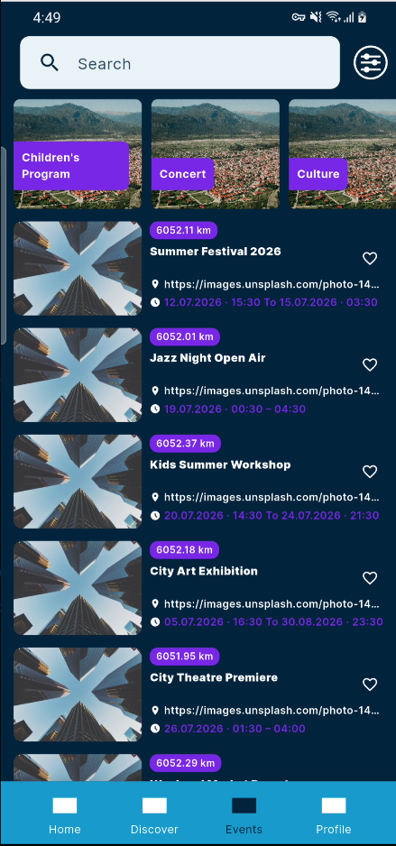 | 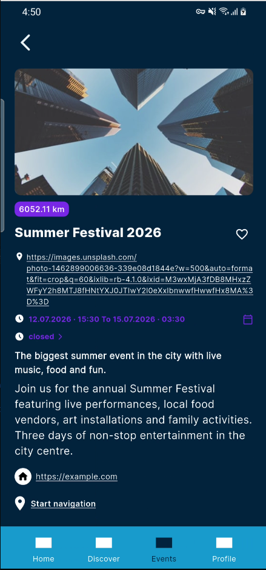 |

| Home sections | Event filter | Settings |
|---|---|---|
| 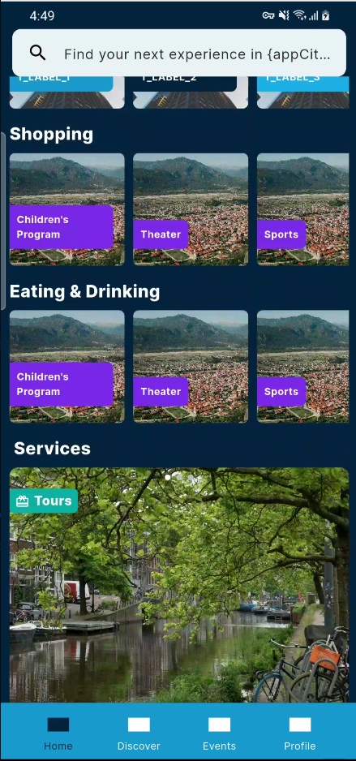 | 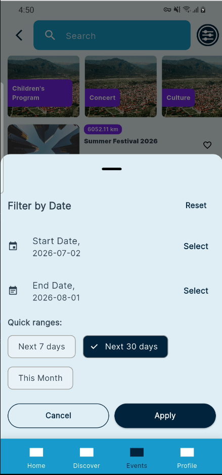 | 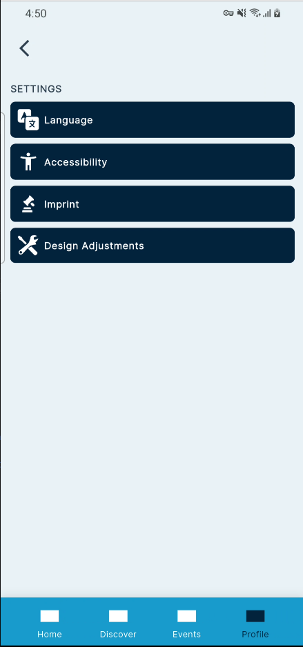 |

### Template B — Civic / Dashboard

| Dashboard | News | Services | Contact |
|---|---|---|---|
| 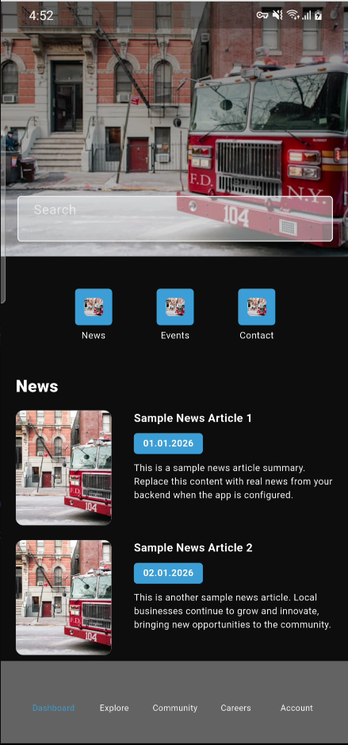 | 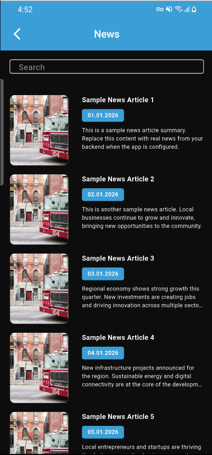 | 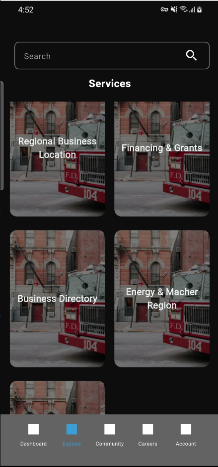 | 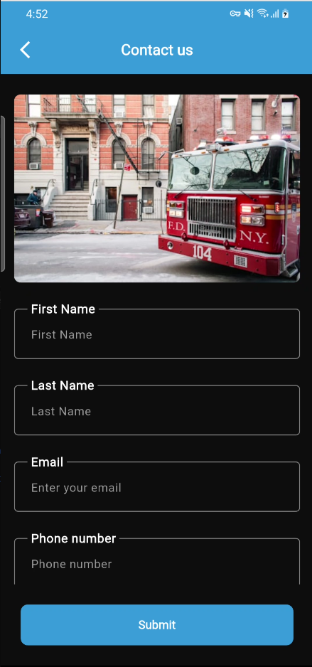 |

### Template C — Listings & Discovery

| Welcome | Location | Home | Today's events |
|---|---|---|---|
| 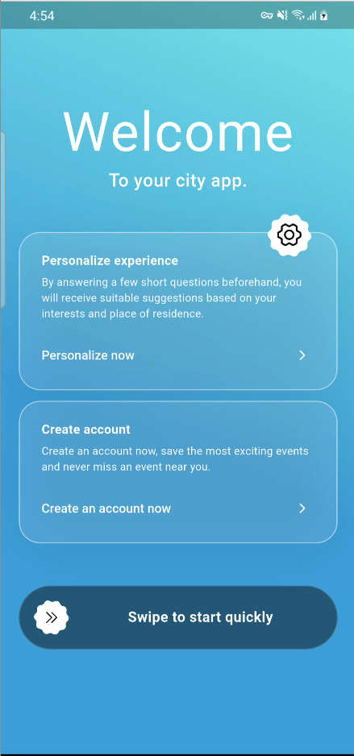 | 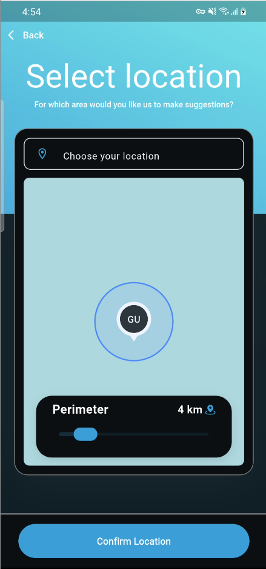 | 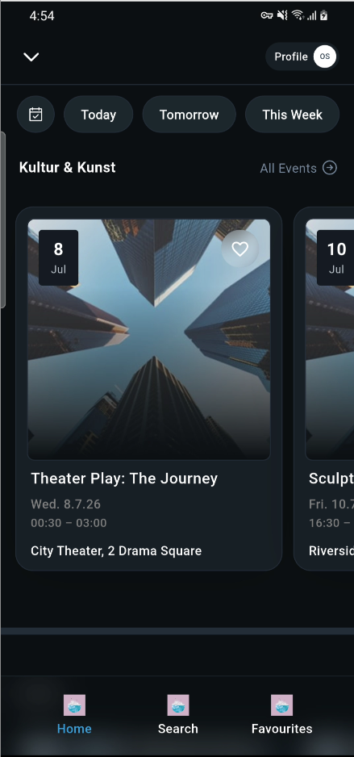 | 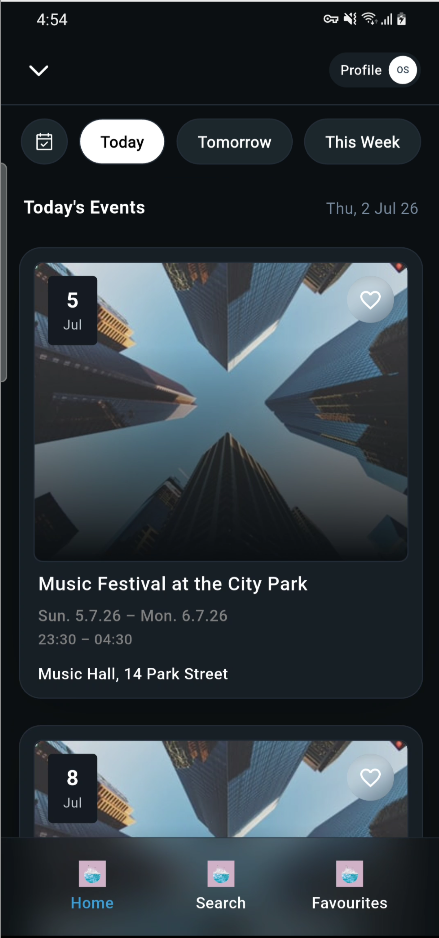 |

| Search & filter | Event detail | Profile |
|---|---|---|
| 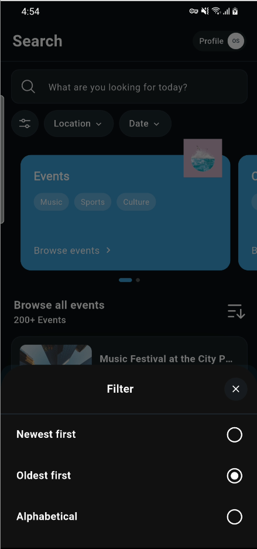 | 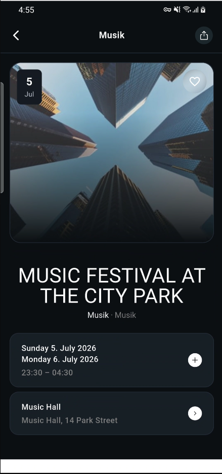 | 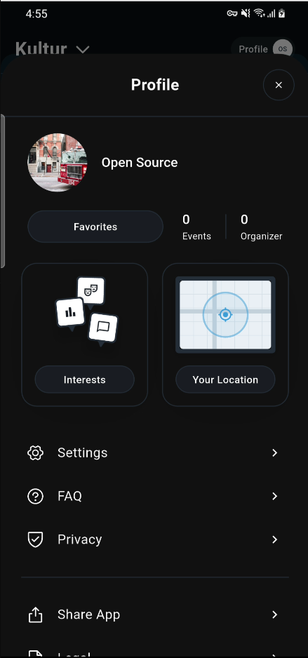 |

---

## Shared Packages

### `packages/network`
HTTP layer built on top of `dio`. Provides `ApiHelper` with typed GET/POST/PUT/PATCH/DELETE methods, an `AuthInterceptor` that auto-attaches bearer tokens and handles 401 refresh, and a `ConnectivityInterceptor` that short-circuits requests when offline.

### `packages/routing`
Thin wrappers around `go_router` — `RoutingController`, `RouteObserver`, and a `GoRouterRefreshStream` that triggers router rebuilds when auth state changes.

### `packages/theme`
Centralised color tokens, typography scale, and `AppTheme` extension for Riverpod. Supports light and dark mode. Templates read from this package instead of hardcoding colors.

### `packages/locale`
`LocaleInitializer` that merges app-shell translation maps with per-feature translation maps. Exposes the `.tr` extension used throughout all templates.

### `packages/preference_manager`
Unified storage wrapper — `SharedPrefService` for primitive values and `HiveService` for structured models. Provides a `preferenceManagerProvider` consumed by every template.

### `packages/common_components`
Shared widget library:

| Widget / Handler | Purpose |
|---|---|
| `CommonAppBar` | App bar with optional back button, actions, and `bottom` widget |
| `CommonWebViewWidget` | In-app WebView with PDF/download detection and close-button variant |
| `CommonPdfViewerWidget` | In-app PDF renderer |
| `CommonText` | Styled text with `.tr` localisation |
| `CommonIcon` | Icon with tap handler |
| `AppSnackBar` | Standardised snack bar (success / error) |
| `PdfViewerHandler` | Action handler that pushes the PDF viewer route |
| `WebViewHandler` | Action handler that pushes the WebView route |

---

## Prerequisites

| Tool | Version | Notes |
|---|---|---|
| Flutter | `3.38.10` | Pinned via FVM — see `.fvmrc` |
| Dart | `^3.10.0-290.4.beta` | Comes with the pinned Flutter |
| FVM | any | `dart pub global activate fvm` |
| Melos | `^7.3.0` | Invoked via `fvm dart run melos` |

> **Always use `fvm flutter` and `fvm dart`** — bare `flutter`/`dart` may resolve to a different SDK version and produce inconsistent results.

### Install FVM

```bash
dart pub global activate fvm
fvm install        # reads .fvmrc and installs the pinned SDK
fvm use            # sets the local symlink
```

---

## Getting Started

### 1. Clone the repo

```bash
git clone <repo-url>
cd suite_mobile
```

### 2. Install the pinned Flutter SDK

```bash
fvm install
```

### 3. Bootstrap the workspace

This resolves all package dependencies across the monorepo in one step:

```bash
fvm dart run melos bootstrap
```

### 4. Verify setup

```bash
fvm dart run melos list
```

You should see all 9 packages listed.

---

## Environment Configuration

Each template reads its runtime config from `assets/env/.env`. The file ships with placeholder values that put the app into **offline / demo mode**:

```env
BASE_URL = YOUR_BASE_URL
TENANT_ID = YOUR_TENANT_ID
X-Api-Key = YOUR_API_KEY
```

To connect a template to a live backend, replace the placeholders:

```env
BASE_URL = https://api.your-backend.com
TENANT_ID = xxxxxxxx-xxxx-xxxx-xxxx-xxxxxxxxxxxx
X-Api-Key = your-api-key-here
```

> The app detects offline mode by checking whether `BASE_URL` starts with `YOUR_` or is empty. When in offline mode, every data layer reads from the JSON files in `assets/config/` instead of making network requests.

---

## Running a Template

### Template A

```bash
cd apps/template_a
fvm flutter run
```

### Template B

```bash
cd apps/template_b
fvm flutter run
```

### Template C

```bash
cd apps/template_c
fvm flutter run
```

### Run on a specific device

```bash
fvm flutter devices                        # list connected devices
fvm flutter run -d <device-id>
```

### Build a release APK

```bash
cd apps/template_a          # or template_b / template_c
fvm flutter build apk --release
```

---

## Offline / Demo Mode

When `BASE_URL` contains `YOUR_BASE_URL` (the default), the app runs entirely from local JSON assets — **no network calls are made**. This makes every template fully runnable out of the box without any backend setup.

**What works in offline mode**

- Full home screen with all component types rendered
- Category and listing screens populated from local JSON
- Language selection (English + German)
- Theme switching (light / dark)
- Favourites (in-memory, not persisted to backend)
- All navigation tabs and routing

**What is stubbed in offline mode**

- Authentication (login / register returns a mock success)
- User profile (returns a demo user)
- Quick filters (returns empty groups — no API call)
- Notification preferences (returns empty prefs)
- FCM token registration (no-op)

---

## Adding a New Template

1. Copy an existing template directory:
   ```bash
   cp -r apps/template_a apps/template_d
   ```

2. Update `apps/template_d/pubspec.yaml`:
   ```yaml
   name: template_d
   ```

3. Replace all `package:template_a/` imports inside `apps/template_d/lib/`:
   ```bash
   find apps/template_d/lib -name "*.dart" \
     -exec sed -i 's/package:template_a\//package:template_d\//g' {} \;
   ```

4. Add the new app to the workspace in root `pubspec.yaml`:
   ```yaml
   workspace:
     - apps/template_d   # add this line
   ```

5. Update `apps/template_d/android/app/build.gradle.kts` — set your `applicationId` and `namespace`.

6. Update `assets/env/.env` with your backend credentials (or leave as placeholders for offline mode).

7. Bootstrap:
   ```bash
   fvm dart run melos bootstrap
   ```

---

## Architecture Overview

```
┌─────────────────────────────────────────────────┐
│                   App Template                  │
│  main.dart → ProviderScope → RouterProvider     │
│                                                 │
│  ┌──────────┐  ┌──────────┐  ┌──────────────┐  │
│  │  Routes  │  │ Features │  │   Providers  │  │
│  └──────────┘  └──────────┘  └──────────────┘  │
└────────────────────┬────────────────────────────┘
                     │ imports
     ┌───────────────┼───────────────────┐
     ▼               ▼                   ▼
┌─────────┐   ┌────────────┐   ┌──────────────────┐
│ network │   │   theme    │   │ common_components│
└─────────┘   └────────────┘   └──────────────────┘
     ▼               ▼                   ▼
┌──────────────────────────────────────────────────┐
│         routing │ locale │ preference_manager    │
└──────────────────────────────────────────────────┘
```

**State management** — Riverpod 3.x (`flutter_riverpod`). Every feature exposes a `NotifierProvider` or `AsyncNotifierProvider`. The root `ProviderScope` in `main.dart` holds `appProviderOverrides`.

**Routing** — `go_router` 17.x. Static app routes live in `lib/routes/app_routes.dart`. Bottom navigation shell routes are driven by the `bottom_config.json` / `bottom_nav.json` config — adding a tab is a config change, not a code change.

**Data flow** — Each feature follows a clean-architecture layering:
```
Service (HTTP / local JSON)
  └── Repository (interface + impl)
        └── UseCase
              └── Controller (Riverpod Notifier)
                    └── Screen / Widget
```

**Offline detection** — `isLiveMode` getter in `lib/core/utils/config_mode.dart` checks `dotenv.maybeGet('BASE_URL')`. Returns `false` when value starts with `YOUR_` or is empty. Every service checks this before making any network call.

**Localisation** — Each template ships `lib/loacalize_value/en.dart` and `de.dart`. App-shell strings are registered in `main.dart` via `LocaleInitializer.initializeAppTranslations(...)`. The `.tr` extension resolves keys at runtime.

---

## Key Dependencies

| Package | Version | Purpose |
|---|---|---|
| `flutter_riverpod` | `^3.1.0` | State management |
| `go_router` | `^17.0.1` | Declarative routing |
| `dio` | `^5.9.0` | HTTP client |
| `flutter_dotenv` | `^6.0.0` | `.env` file loading |
| `hive` / `hive_flutter` | `^2.2.3` / `^1.1.0` | Local structured storage |
| `flutter_screenutil` | `^5.9.3` | Responsive sizing |
| `dartz` | `^0.10.1` | Functional `Either` type for error handling |
| `permission_handler` | `^12.0.1` | Runtime permissions |
| `url_launcher` | `^6.3.2` | Open URLs in browser |
| `share_plus` | `^10.1.4` | Native share sheet |
| `upgrader` | `^11.4.0` | In-app update prompts |
| `melos` | `^7.3.0` | Monorepo tooling |

> `analyzer` is overridden to `6.4.1` in the root `pubspec.yaml` — do not remove or change this; it is required for the current Dart SDK constraint.
